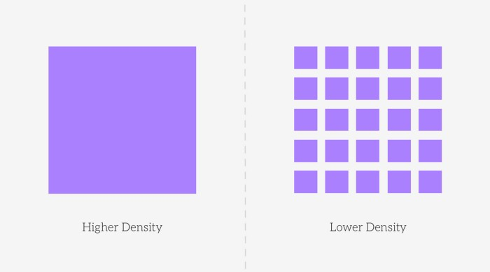

# Web design course with CSS Grid and Flexbox by Platzi

This repository is about what I learned in the web design course with CSS Grid and Flexbox by Platzi.

## Screenshot


## Built with 

- Semantic HTML5 markup
- CSS grid
- Flexbox
- Mobile first workflow
- Neumorphism

## What I learned

### Design fundamentals for web pages

1. **Hierarchy:** it refers to having elements larges than other elemnts, based on the relevance and importance than we want to give to each one of them. 


2. **Contrast:** is defined as the relative difference in intensity between an elemnt. 


3. **Proximity:** when we see several elements than resemble each other, we already know that they belong to a group of elements. This helps users to select thing faster and easier.


3. **Balance:** it refers to visual weight of the elements. There are multiple parameters that affect the visual weight:

    - **Size:**
        - 
    - **Colour:**
        - 
    - **Contrast:**
        - 
    - **Density:**
        - 

### CSS layouts

1. **Super Centered:** Let´s solve the biiggest mystery in all of the CSS land: centering things. 

```css
.parent {
    display: grid;
    place-items: center;
}
```
2. **The Deconstructed Pancake:** This is a common layout for marketing sites, for example, wich may have a row of 3 items, usually with an image, title and then some text. On mobile, we´ll want those to stack nicely, and expand as we increase the screen size.

```css
.parent {
    display: flex;
    flex-wrap: wrap;
    justify-content: center;
}

.child {
    flex: 0 1 150px;
}
```
The flex shorthand stands for: 
- flex-grow
- flex-shrink
- flex-basis

3. **Sidebar Says:** This demo takes advantage of the minmax function for grid layouts. What we´re doing here is setting the minimum sidebar to be ``150px``, but on larger screens, letting that stretch out to ``25%``. The sidebar will always take up ``25%`` of its parent´s horizontal space untile that ``25%`` becomes smaller than ``150px``.

```css
.parent {
    display: grid;
    grid-template-columns: minmax(150px, 25%) 1fr;
}
```

4. **Pancake Stack:** Unlike the Deconstructed Pancake, this example does not wrap its children when the screen size changes. Commonly referred to as a stick footer, this layout is often used for both websites and apps, across mobile applications (the footer is commonly a toolbar), and websites (single page applications often use thus global layout).

```css
.parent {
    display: grid;
    grid-template-rows: auto 1fr auto;
}
```

5. **Classic Holy Grail Layout:** For this classic holy grail layout, there is a header, footer, left sidebar, right sidebar, and main content. It´s similar to the previous layout, but now with sidebars!

```css
.parent {
    display: grid;
    grid-template: auto 1fr auto / auto 1fr auto;
}

.header {
    grid-column: 1 / 4;
}

.left-side {
    grid-column: 1 / 2;
}
```

6. **12-Span Grid:** We can quickly write grids in CSS witg the ``repeat()`` functin. Using: ``repeat(12, 1fr);`` for the grid template columns gives you 12 columns each of 1fr.

```css
.parent {
    display: grid;
    grid-template-columns: repeat(12, 1fr);
}

.child-span-12 {
    grid-column: 1 / 13;
}
```
Another way to write this is by using the ``span`` keyword:

```css
.child-span-12 {
    grid-column: 1 / span 12;
}
```

7. **RAM (Repeat, Auto, MinMax):** Combine some of the concepts you´ve already learned about to create a responsive layout with automatically-place and flexible children. Pretty neat. The key terms to remember here are ``repeat()``, ``auto-(fit|fill)``, and ``minmax()``, which you remember by the acronym RAM.

```css
.parent {
    display: grid;
    grid-template-columns: repeat(auto-fit, minmax(150px, 1fr));
}
```

8. **Line Up:** Here the main point to demonstrate here is ``justify-content: space-between``, which places the first and last child elements at the edges of their bounding box, with the remaining space evenly distributed between the elements.

```css
.parent {
    display: flex;
    flex-direction: column;
    justify-content: space-between;
}
```


9. **Clamping My Style:** Here´s where we get into some techniques with less browser support, but have some really exciting implications for layouts and responsive UI design- In this dome, you are setting the width using clamp like so: ``clamp(<min>, <actual>, <max>)``.

```css
.parent {
    width: clamp(23ch, 60%, 46ch)
}
```

10. **Respect for Aspect:** With the aspect-ratio property, as I resize the card, the greem visual block maintains this 16 x 9 aspect ratio. We are Respecting the Adpect Ratio with aspect-ratio: 16 / 9. 

```css
.video {
    aspect-ratio: 16 / 9;
}
```

### Use cases, differences and similarities between Flexbox and CSS Grid

- **Flexbox:** is a method that can help distribute the space between items in an interface and improve alignment capabilities.

Flexbox, however, is one-dimensional. That is, it allows us to align in a single direction.

- **CSS Grid:** It is a layout system that allows auto-aligning elements in columns and rows.

It is a two-dimensional system. That is, it allows us to align in two directions.