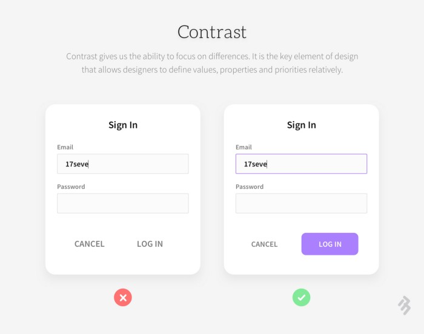

# Web design course with CSS Grid and Flexbox by Platzi

This repository is about what I learned in the web design course with CSS Grid and Flexbox by Platzi.

## Screenshot

## Built with 

- Semantic HTML5 markup
- CSS grid
- Flexbox
- Mobile first workflow
- Neumorphism

## What I learned

### Design fundamentals for web pages

- Hierarchy: it refers to having elements larges than other elemnts, based on the relevance and importance than we want to give to each one of them. 

- Contrast: is defined as the relative difference in intensity between an elemnt. 

- Proximity: when we see several elements than resemble each other, we already know that they belong to a group of elements. This helps users to select thing faster and easier.

- Balance: it refers to visual weight of the elements. There are multiple parameters that affect the visual weight:

A) Size: 

B) Colour:

C) Contrast:

D) Density: 
1